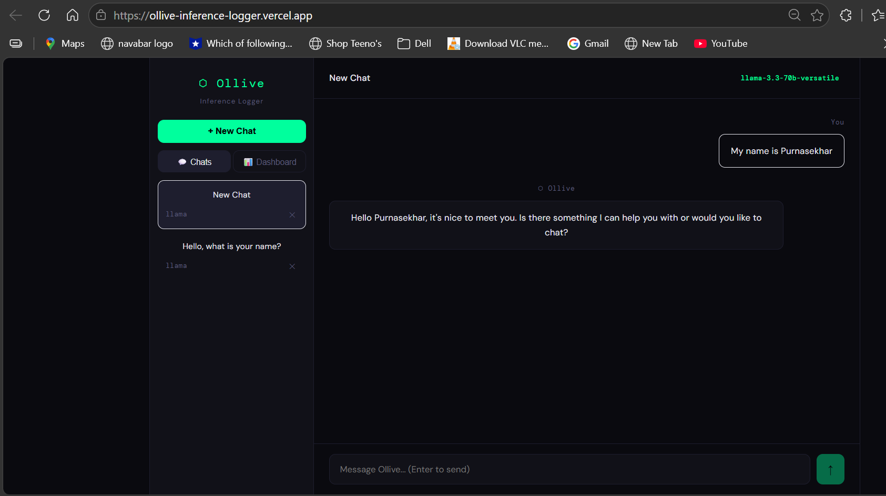
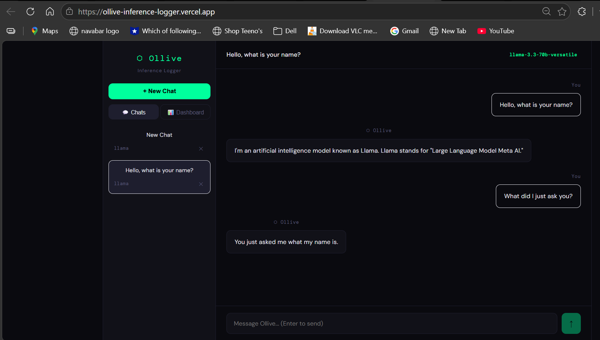
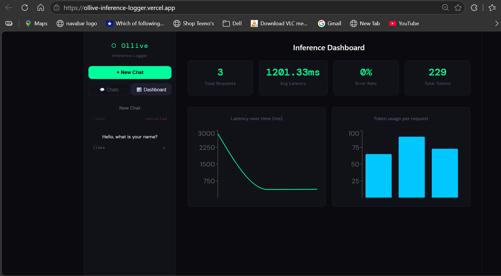
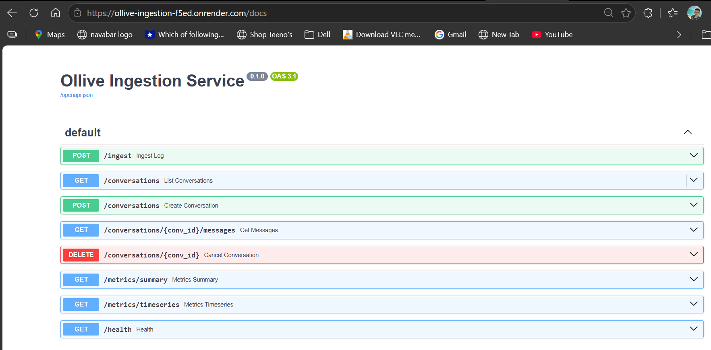

# ⬡ Ollive Inference Logger

A lightweight, production-grade inference logging and ingestion system for LLM applications - built as a Founding Engineer assignment for [Ollive.ai](https://ollive.ai)

---

## 🌐 Live Demo

| Service | URL |
|---|---|
| 🖥️ Frontend (Vercel) | https://ollive-inference-logger.vercel.app |
| ⚙️ Backend API (Render) | https://ollive-ingestion-f5ed.onrender.com/health |
| 📄 API Docs (Swagger) | https://ollive-ingestion-f5ed.onrender.com/docs |

> ⚠️ First load may take ~30 seconds — Render free tier spins down after inactivity.

---

## 📸 Screenshots

### 💬 Chat Interface


### 🧠 Multi-turn Memory


### 📊 Inference Dashboard


### 📄 API Documentation


---

## 🏗️ Architecture Overview

```
┌─────────────────────────────────────────────────────────────┐
│                        Browser / UI                         │
│                    React + Vite Frontend                    │
└───────────────────────┬─────────────────────────────────────┘
                        │ user sends message
                        ▼
┌─────────────────────────────────────────────────────────────┐
│                      OlliveSDK                              │
│   Wraps LLM API calls — captures metadata in real time      │
│   • latency  • tokens  • session ID  • timestamps           │
│   • status   • provider  • model  • input/output preview    │
└────────────┬──────────────────────────┬─────────────────────┘
             │ streaming chunks         │ fire-and-forget logs
             ▼                          ▼
┌────────────────────┐     ┌────────────────────────────────┐
│   Groq API         │     │   FastAPI Ingestion Service     │
│   Llama 3.3-70b    │     │   POST /ingest                  │
│   (SSE Streaming)  │     │   • validates payload           │
└────────────────────┘     │   • redacts PII                 │
                           │   • stores to PostgreSQL        │
                           │   • publishes to Redis Stream   │
                           └──────────────┬─────────────────┘
                                          │
                           ┌──────────────▼─────────────────┐
                           │         PostgreSQL              │
                           │  conversations │ messages       │
                           │  inference_logs                 │
                           └────────────────────────────────┘
                                          │
                           ┌──────────────▼─────────────────┐
                           │       Redis Streams             │
                           │   Event-based architecture      │
                           │   inference_logs stream         │
                           └────────────────────────────────┘
```

---

## ✨ Features

### Core
| Feature | Details |
|---|---|
| 💬 Multi-turn Chatbot | Full conversation context sent with every request |
| ⚡ Streaming Responses | Server-Sent Events (SSE) — word by word rendering |
| 🧠 Conversation Memory | Resume any past conversation from sidebar |
| ❌ Cancel Conversations | Soft-cancel with status tracking |
| 📋 List Conversations | Sidebar with all sessions, titles, models |

### SDK / Logging
| Metadata Captured | Description |
|---|---|
| `provider` | groq / anthropic / gemini |
| `model` | e.g. llama-3.3-70b-versatile |
| `latency_ms` | End-to-end response time |
| `prompt_tokens` | Input token count |
| `completion_tokens` | Output token count |
| `total_tokens` | Combined usage |
| `conversation_id` | UUID session identifier |
| `message_id` | Per-message UUID |
| `status` | success / error |
| `timestamp` | ISO 8601 |
| `input/output preview` | First 200 chars (PII redacted) |

### Bonus Features ✅
- ✅ **Streaming responses** — SSE with real-time token rendering
- ✅ **Latency + Token dashboards** — live charts with Recharts
- ✅ **Docker Compose** — one-command full stack setup
- ✅ **Event-based architecture** — Redis Streams (xadd/xread)
- ✅ **PII redaction** — email, phone, Aadhaar, PAN, SSN, card numbers
- ✅ **Multi-provider SDK** — Groq, Gemini, OpenRouter supported
- ✅ **List / Resume / Cancel** conversations in UI
- ✅ **K8s deployment** — deployments, services, ingress, secrets for all 4 components in `/k8s`

---

## 🗄️ Schema Design

### `conversations`
```sql
id          VARCHAR   PRIMARY KEY   -- UUID
title       VARCHAR                 -- auto-set from first message
provider    VARCHAR                 -- groq / anthropic / gemini
model       VARCHAR                 -- model name
is_active   INTEGER   DEFAULT 1     -- 0 = cancelled
created_at  DATETIME
updated_at  DATETIME
```

### `messages`
```sql
id               VARCHAR   PRIMARY KEY
conversation_id  VARCHAR   FK → conversations.id
role             VARCHAR   -- user | assistant
content          TEXT      -- PII redacted
content_preview  VARCHAR   -- first 200 chars
created_at       DATETIME
```

### `inference_logs`
```sql
id                VARCHAR   PRIMARY KEY
conversation_id   VARCHAR   FK → conversations.id
message_id        VARCHAR   FK → messages.id
provider          VARCHAR
model             VARCHAR
latency_ms        FLOAT
prompt_tokens     INTEGER
completion_tokens INTEGER
total_tokens      INTEGER
status            VARCHAR   -- success | error
error_message     TEXT
timestamp         DATETIME
extra_metadata    JSON
```

### 💡 Schema Design Decisions
- **Separate `inference_logs` from `messages`** — clean separation of concerns; chat data vs observability data
- **Soft delete for conversations** (`is_active=0`) — preserves data for analytics while hiding from UI
- **`content_preview` column** — avoids loading full content for list views, better performance at scale
- **`extra_metadata` JSON column** — flexible field for future metadata (cost, region, temperature) without migrations
- **PostgreSQL over SQLite** — production-ready, concurrent writes safe, JSON column support

---

## ⚖️ Tradeoffs Made

| Decision | Chosen | Alternative | Reason |
|---|---|---|---|
| Queue | Redis Streams | Kafka | Simpler ops, sufficient for this scale |
| Streaming | SSE | WebSockets | Lighter, unidirectional, perfect for chat |
| DB | PostgreSQL | SQLite | Production-ready, concurrent writes |
| SDK logging | Fire-and-forget | Blocking | Doesn't impact UX/latency |
| PII redaction | Regex patterns | Presidio/spaCy | Zero dependency, fast, covers key patterns |
| Provider | Groq | OpenAI | Free tier, fastest inference available |

---

## 🚀 Quick Start

### Option A — Docker Compose (Recommended)

```bash
# 1. Clone the repo
git clone https://github.com/YOUR_USERNAME/ollive-inference-logger.git
cd ollive-inference-logger

# 2. Set environment variables
cp .env.example .env
# Edit .env and add your GROQ_API_KEY

# 3. One command startup
docker-compose up --build

# Frontend → http://localhost:5173
# Backend  → http://localhost:8000
# API Docs → http://localhost:8000/docs
```

### Option B — Local Development

**Backend:**
```bash
cd ingestion-service
python -m venv .venv
source .venv/bin/activate  # Windows: .venv\Scripts\Activate.ps1

pip install fastapi uvicorn sqlalchemy psycopg2-binary redis python-dotenv pydantic aiohttp

# Start PostgreSQL and Redis via Docker
docker run -d --name ollive-pg -e POSTGRES_USER=ollive -e POSTGRES_PASSWORD=ollive -e POSTGRES_DB=ollive -p 5434:5432 postgres:15
docker run -d --name ollive-redis -p 6379:6379 redis:7-alpine

uvicorn main:app --reload --port 8000
```

**Frontend:**
```bash
cd frontend
npm install
npm run dev
# → http://localhost:5173
```

---

## 🔐 Environment Variables

### Root `.env`
```env
GROQ_API_KEY=your_groq_key_here
```

### `frontend/.env`
```env
VITE_GROQ_KEY=your_groq_key_here
VITE_INGESTION_URL=http://localhost:8000
```

---

## ☸️ Kubernetes Deployment

K8s manifests for all components are in the `/k8s` folder.

### Structure
```
k8s/
├── deployment.yaml   # Postgres, Redis, Ingestion (2 replicas), Frontend (2 replicas)
└── service.yaml      # Namespace, Secrets, ClusterIP services, LoadBalancer, Ingress
```

### Deploy to a K8s Cluster
```bash
# 1. Create namespace + secrets
kubectl apply -f k8s/service.yaml

# 2. Deploy all components
kubectl apply -f k8s/deployment.yaml

# 3. Verify pods are running
kubectl get pods -n ollive

# 4. Get frontend URL
kubectl get svc -n ollive
```

### What's Included
| Resource | Details |
|---|---|
| `Namespace` | `ollive` — isolated environment |
| `Deployments` | Postgres, Redis, Ingestion (2 replicas), Frontend (2 replicas) |
| `Services` | ClusterIP for internal, LoadBalancer for frontend |
| `Ingress` | nginx — routes `/` to frontend, `/api` to ingestion |
| `Secrets` | DB credentials stored as K8s Secret |
| `Health checks` | Liveness + readiness probes on ingestion service |

---

## 📡 API Reference

| Method | Endpoint | Description |
|---|---|---|
| `POST` | `/ingest` | Receive inference log from SDK |
| `GET` | `/conversations` | List all conversations |
| `POST` | `/conversations` | Create new conversation |
| `GET` | `/conversations/{id}/messages` | Get messages for a conversation |
| `DELETE` | `/conversations/{id}` | Cancel a conversation |
| `GET` | `/metrics/summary` | Aggregated metrics |
| `GET` | `/metrics/timeseries` | Per-request timeseries data |
| `GET` | `/health` | Health check |

Full interactive docs: https://ollive-ingestion-f5ed.onrender.com/docs

---

## 🔄 Ingestion Flow

```
1. User types message
        ↓
2. OlliveSDK.logUserMessage() → POST /ingest (non-blocking)
        ↓
3. OlliveSDK.chat() → streams from Groq API via SSE
        ↓
4. Chunks render in UI word-by-word
        ↓
5. On completion → OlliveSDK captures:
   latency, tokens, status, timestamps
        ↓
6. POST /ingest (non-blocking, fire-and-forget)
        ↓
7. Ingestion service:
   → validates Pydantic schema
   → redacts PII from content
   → upserts conversation record
   → inserts message record
   → inserts inference_log record
   → publishes to Redis Stream (inference_logs)
        ↓
8. Dashboard reads /metrics/summary + /metrics/timeseries
```

---

## 📈 Scaling Considerations

| Concern | Current Approach | At Scale |
|---|---|---|
| **Ingestion throughput** | Synchronous FastAPI | Add async background tasks or Celery workers consuming Redis stream |
| **Database writes** | Direct SQLAlchemy | Connection pooling (PgBouncer), write batching |
| **Redis stream** | Single stream | Partition by provider or tenant |
| **Frontend** | Single deployment | CDN-cached static assets (already on Vercel) |
| **Multi-tenancy** | Single DB | Row-level tenant isolation with API key auth |
| **Storage** | Unlimited growth | TTL-based archival, partition by month |

---

## 🛡️ Failure Handling

| Failure | Handling |
|---|---|
| **SDK log fails** | Silent catch — never blocks the chat UX |
| **LLM API error** | Caught, stored as `status=error` in inference_log, shown to user |
| **DB connection loss** | SQLAlchemy connection pool retries |
| **Redis unavailable** | Logged as warning, ingestion continues without event publish |
| **PII redaction** | Applied before any DB write — source content never stored raw |

---

## 🔮 What I'd Improve With More Time

- [ ] **Background stream worker** — async consumer processing Redis stream events
- [ ] **Auth layer** — API keys per tenant, JWT for frontend
- [ ] **Cost tracking** — per-provider token pricing, cost per conversation
- [ ] **Alerting** — error rate spike detection, latency threshold alerts  
- [ ] **Helm Charts** — package K8s manifests as Helm charts for configurable multi-environment deployment
- [ ] **Rate limiting** — per-IP and per-API-key limits on ingestion endpoint
- [ ] **Export** — download conversation history as JSON/CSV
- [ ] **More providers** — OpenAI, Anthropic, Gemini with automatic fallback

---

## 🧰 Tech Stack

| Layer | Technology |
|---|---|
| Frontend | React 18, Vite, Recharts, Axios |
| SDK | Vanilla JS (zero dependencies) |
| Backend | FastAPI, Python 3.11, Pydantic |
| Database | PostgreSQL 15, SQLAlchemy |
| Cache/Events | Redis 7, Redis Streams |
| Deployment | Vercel (frontend), Render (backend) |
| Container | Docker, Docker Compose |

---

## 👤 Author

**Sunkara PurnaSekhar**
Built for Ollive.ai Founding Engineer Assignment
